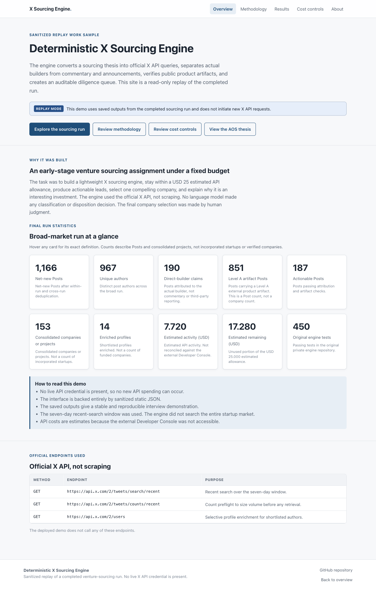
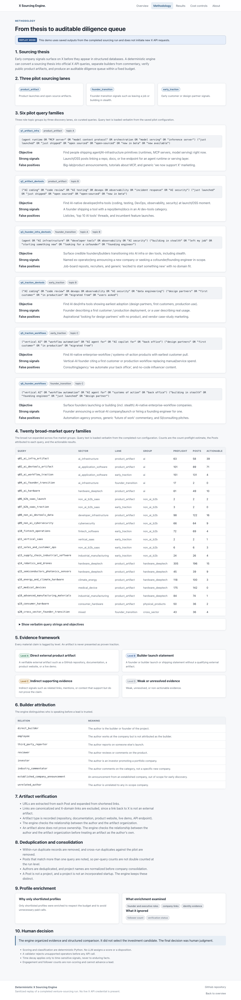
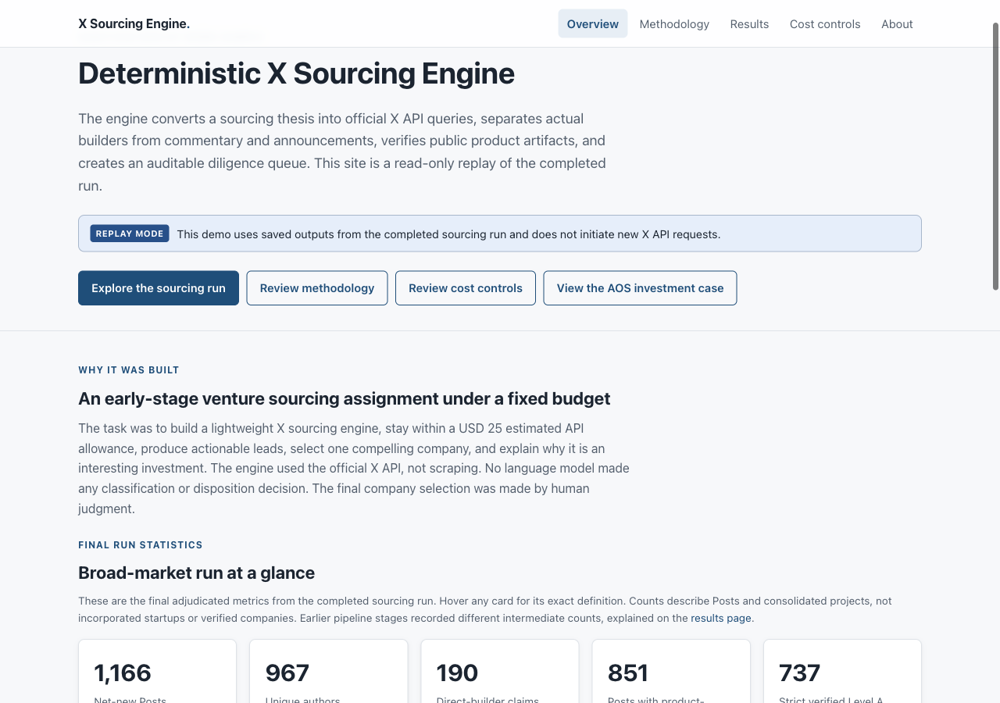
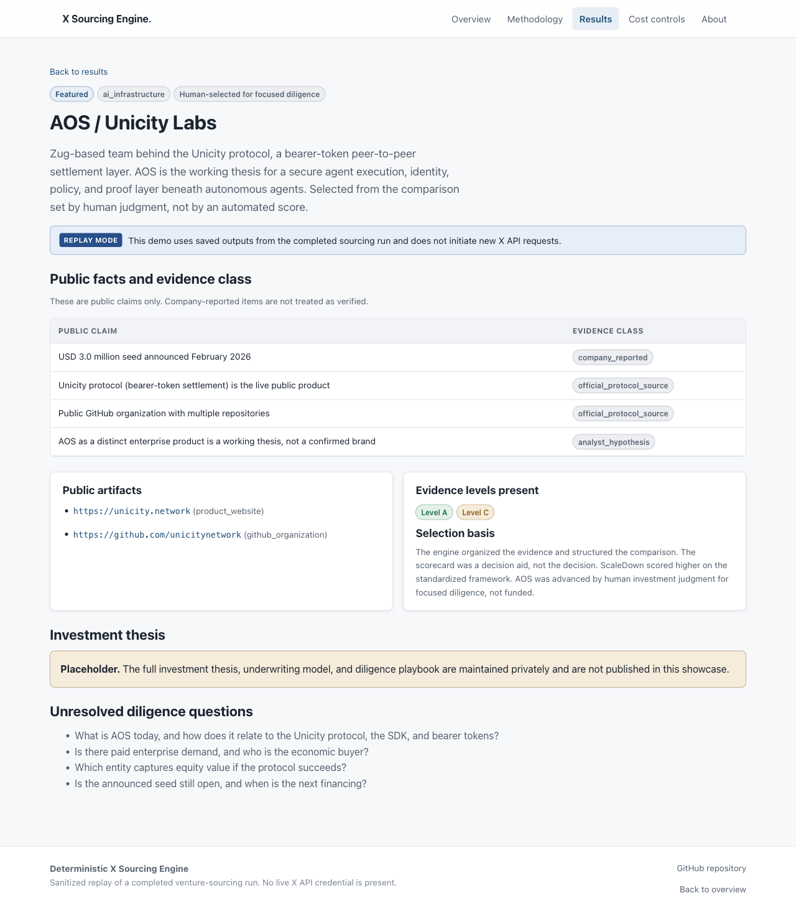
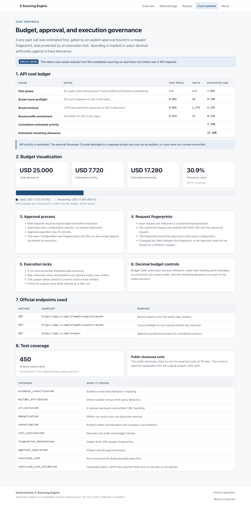

# Deterministic X Sourcing Engine

A deterministic, budget-controlled X sourcing engine for early-stage venture
discovery, demonstrated through a sanitized replay of a completed run.

> **This public demo is a sanitized replay of a completed sourcing run. It does
> not contain an X API credential and does not initiate new X API requests.**

- Interactive demo: https://x-sourcing-engine.vercel.app
- Sanitized repository: https://github.com/smodi13/x-sourcing-engine-showcase

## Overview

The engine converts a sourcing thesis into official X API queries, separates
actual builders from commentary and announcements, verifies public product
artifacts, deduplicates and consolidates results, selectively enriches
shortlisted profiles, and produces an auditable diligence queue. Scoring and
classification are deterministic Python. No language model assigns a score or a
disposition, and the final company selection was made by human judgment.

This repository contains sanitized engine excerpts, the sanitized static demo
data, and a read-only Next.js site that replays the completed run.

## Assignment summary

The task was to build a lightweight X sourcing engine for early-stage venture
discovery, stay within a USD 25 estimated API allowance, produce actionable
leads, select one compelling company, and explain why it is an interesting
investment.

## Sourcing thesis

Early company signals surface on X before they appear in structured databases. A
deterministic engine can convert a thesis into official queries, separate
builders from commentary, verify public artifacts, and produce an auditable
diligence queue within a fixed budget.

## Architecture

```
Sourcing thesis
  to Query configuration
  to Count preflight
  to Recent search
  to URL resolution
  to Evidence classification
  to Builder attribution
  to Deduplication
  to Project consolidation
  to Selective profile enrichment
  to Diligence queue
  to Human investment decision
```

See `docs/architecture.md` for the full data flow.

## Pipeline

Each stage is deterministic Python. A validator rejects unsupported operators
before any API call. URLs are canonicalized and X-domain links are excluded.
Evidence is tagged Level A to D. Builder attribution decides who is speaking.
Duplicates are removed within and across runs, and records are consolidated into
projects. Only shortlisted profiles are enriched. See `docs/methodology.md`.

## Pilot results

- 6 query families across 3 sourcing lanes
- 177 returned Post resources, 176 unique Posts, 146 unique authors
- 30 direct-builder claims, 20 Level A artifact Posts
- 29 retained leads (7 keep_verified, 22 keep_for_enrichment)
- 11 profiles enriched
- Approximately USD 1.085 in cumulative estimated activity

## Broad-run results

- 20 broad-market query families, 20 count-preflight requests
- 1,486 aggregate seven-day count, 25 retrieval HTTP requests
- 1,279 returned Post resources, 1,166 net-new Posts
- 26 cross-run duplicates removed, 70 within-run duplicate records removed, 68 Posts matched multiple queries
- 967 unique authors, 190 direct-builder claims
- 851 Posts with external product-artifact links, of which 737 met the strict verified Level A standard
- 187 actionable Posts
- 159 engine-consolidated actionable projects, 153 projects after final analyst adjudication
- 14 profiles enriched, 14 profiles returned
- USD 7.720 cumulative estimated API activity, USD 17.280 estimated unused allowance from the USD 25.000 allowance

Public funnel order:

1. 1,166 net-new Posts
2. 851 Posts with external product-artifact links
3. 737 strict verified Level A Posts
4. 190 direct-builder claims
5. 187 actionable Posts
6. 159 engine-consolidated actionable projects
7. 153 projects after final analyst adjudication
8. 122 sanitized broad-run project records displayed publicly
9. 1 separate featured AOS investment-analysis page

Counts describe Posts and projects and are stage counts, not strictly nested
subsets. 1,279 is returned Post resources, not unique Posts. 1,166 is net-new
Posts after deduplication. 851 is Posts with external product-artifact links, a
Post count and not a company count, and is broader than the 737 strict verified
Level A Posts. 159 is engine-consolidated actionable projects; 153 remained after
final analyst adjudication. The final six-project reduction was preserved as an
aggregate in the investment package, but the individual merge and reclassification
decisions were not retained in a record-level audit file. The 122 public records
are re-derived from the 187 actionable Posts and are not a direct subtraction from
153. The full provenance is in `docs/metrics-reconciliation.md` and
`public/demo-data/metrics-provenance.json`.

## Cost breakdown

| Phase | Estimated USD |
| --- | --- |
| Pilot phase (cumulative) | 1.085 |
| Broad count preflight (20 requests) | 0.100 |
| Broad retrieval (1,279 posts) | 6.395 |
| Broad profile enrichment (14 profiles) | 0.140 |
| Cumulative estimated activity | 7.720 |
| Estimated remaining allowance | 17.280 |

API activity is estimated because the external Developer Console belonged to a
separate project and was not accessible. See `docs/cost-controls.md`.

## Evidence framework

Level A is a direct external product artifact (repository, documentation,
product website, live demo). Level B is a builder launch statement without a
qualifying external artifact. Level C is indirect supporting evidence. Level D
is weak or unresolved evidence. See `docs/evidence-framework.md`.

## Builder attribution

The engine distinguishes direct builder, employee, third-party reporter,
reviewer, investor, industry commentator, established-company announcement, and
unrelated author. A lead is actionable when a direct builder is paired with a
Level A artifact.

## Deduplication and consolidation

Within-run duplicates and cross-run duplicates against the pilot are removed.
Posts that match more than one query are recorded rather than double counted at
the run level. Project names are normalized before consolidation. A Post is not
a project, and a project is not an incorporated startup.

## Profile enrichment

Only shortlisted profiles were enriched, to respect the budget. Enrichment
examined founder and executive roles, company links, and identity evidence.
Follower count and verification status did not determine advancement.

## Governance and budget controls

Every paid request was estimated first, gated by an explicit approval bound to a
SHA-256 request fingerprint, protected by an execution lock, and tracked in
exact Decimal arithmetic. Approvals expired after fifteen minutes. Raw responses
were stored before any derived output. The system failed closed.

## Test coverage

- Original engine: 450 passing tests.
- Public showcase repository: 95 passing tests covering evidence classification,
  builder attribution, URL exclusion, deduplication, consolidation, cost
  calculations, fingerprint determinism, approval expiration, execution locks,
  sanitized JSON validation, and metric terminology and reconciliation.

Run the showcase tests:

```bash
python -m pip install -r requirements-dev.txt
python -m pytest
```

## Screenshots







## Local demo instructions

```bash
npm install
npm run dev      # http://localhost:3000
npm run build    # production build
npm run start    # serve the production build
```

The demo requires no environment variable and makes no network calls.

## Regenerate the demo data

The sanitized JSON in `public/demo-data/` is generated from the private engine's
saved outputs:

```bash
SOURCE_DIR=/path/to/private/engine python scripts/build_sanitized_demo_data.py
```

`SOURCE_DIR` points at the private engine project root and is never committed.

## Vercel demo

The read-only site is deployed on Vercel and reads only local sanitized static
JSON. It contains no X API credential and initiates no X API request.

## Limitations

The recent-search window is seven days. Results carry platform and query bias. A
public artifact does not guarantee a company was formed, and GitHub activity
does not prove customer demand. API activity is estimated rather than console
reconciled. The engine did not search the entire startup market. See
`docs/limitations.md`.

## Version-two improvements

Longer time horizon and historical search, stronger entity resolution and an
organization and domain graph, improved product-formation detection, stronger
company identity enrichment, source freshness tracking, configurable scoring, an
analyst review workflow, additional public-data sources, and deterministic
replay testing.

## No live API disclaimer

The deployed demo does not call
`https://api.x.com/2/tweets/search/recent`,
`https://api.x.com/2/tweets/counts/recent`, or
`https://api.x.com/2/users`. There is no Run Engine button, no live search, no
API-key input, no server route that calls X, and no hidden live mode. The
interface is backed entirely by sanitized static JSON.

## Security and privacy note

This repository contains no bearer token and no credential. The generated demo
JSON excludes raw Post text, author names, usernames, author ids, and profile
fields, and includes only engine-derived classifications plus public permalinks
and public artifact URLs. The `sharp` image library that ships as an optional
Next.js dependency is not used by this static site.

## License

MIT. See `LICENSE`.
